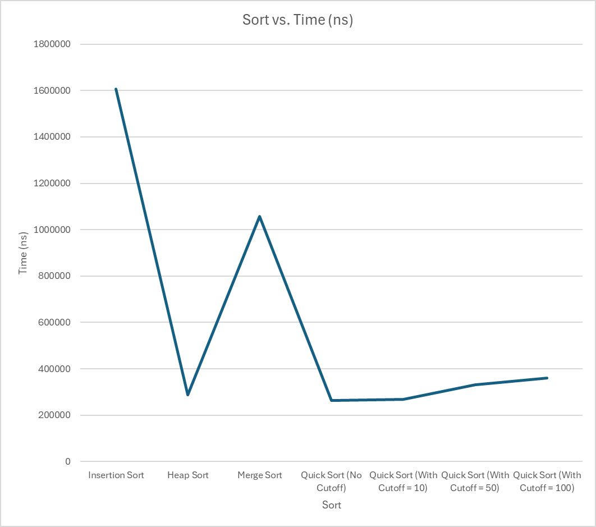
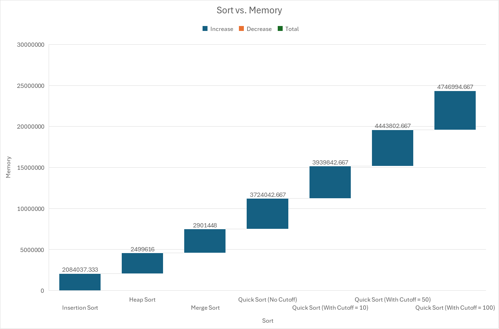

# compare-sorting-algorithms
 Java program that generates random integer arrays, sorts them using various algorithms, and records the runtime for each sorting method. 

 ## Analysis
 Based on the graph I generated from my timing data, it seems that the fastet sorts are Heap Sort and Quick sort (all variations) while Merge sort is medium fast and Insertion sort is quite slow. It seems that the cutoffs on Quick sort made the Quick sort algorithms take more time. My sorts have efficiences of O(n^2) for Insertion sort and the Quick sorts and O(n log n) for Heap and Merge sort. 

